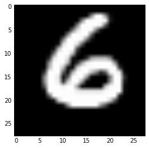

# AI Recognizes Handwritten Digits

In this notebook I used a polynomial support vector machine to classify handwritten digits. The famous "MNIST" dataset was used. 

Though SVM is considered suboptimal for this problem, through a number of optimizations, the model performed very well, with accuracy greater than 98%. To parametrize my model, I used a randomized search. To hypertune my model, I trained on a small subset of the data, otherwise it would've taken too long to find them. Training was relatively fast at about 7 minutes.  

Below I've included some examples that my model misclassified. Based on the way that these look, I think we can forgive the <2% misclassification error.

